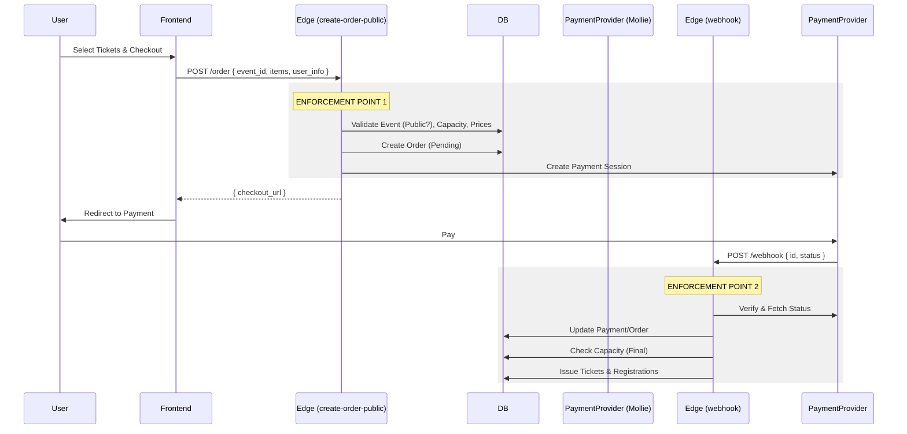

# PAYMENT FLOW DESIGN & VALIDATION

**Status:** ✅ DONE (Implemented in Sprint 14)
**Context:** COLOSS Sprint 14 (Payment Flow Validation)
**Scope:** Public Ticket Purchase (End-to-End)

---

## Implementation Details
- **Edge Functions:** `create-payment`, `mollie-webhook`
- **DB RPC:** `handle_payment_webhook` (handles state transitions)
- **Idempotency:** `payment_events` table with unique constraint on `(provider, provider_event_id)`
- **Enforcement:** Tickets are created as `pending` and only become `valid` after successful webhook processing.

---

## 1. High-Level Flow

---

## 2. Step-by-Step Flow

### Phase A: Ticket Selection (Public UI)
**Preconditions:**
- Frontend fetches `public_events` view (RLS filtered).
- Frontend fetches `ticket_types` (RLS filtered: `status='published'`).

**Untrusted Data:**
- Frontend prices are **display only**.
- Frontend capacity checks are **optimistic**.

### Phase B: Checkout Start (`create-order-public`)
**Trigger:** POST request from frontend.

**Validation Sequence (Strict Order):**
1.  **Sanity Check:** Validate schema (Zod).
2.  **Event Visibility:** `is_event_public(event_id)` MUST be true.
3.  **Sales Window:** Current time MUST be between `sales_start` and `sales_end`.
4.  **Capacity Check (Preliminary):** `sold_count + requested_qty <= capacity_total`.
5.  **Price Calculation:** Fetch `price` from DB for each `ticket_type_id`. Calculate `total`.
    *   *Reject if frontend total mismatches (optional, but good for UX).*

**Action:**
1.  **Create Order:** Insert into `orders` (`status='pending'`, `total_amount=calculated_total`).
2.  **Create Items:** Insert into `order_items`.
3.  **Branching:**
    *   **If Total > 0:**
        *   Call Payment Provider (create session with `order_id` in metadata).
        *   Insert `payments` (`status='open'`, `provider_id=...`).
        *   Return `checkout_url`.
    *   **If Total == 0 (Free):**
        *   **Directly trigger issuance logic** (see Phase D).
        *   Return `success_url`.

**Enforcement Logging:**
- Log `capacity_check` attempt.
- Log `price_calculation` source.

### Phase C: Payment & Webhook
**Trigger:** Provider calls webhook URL.

**Validation:**
1.  **Signature/Fetch:** Verify authenticity of webhook. Fetch latest status from provider API (don't trust payload).
2.  **Idempotency:** Check current `payments.status`. If already `paid`, ignore.

**State Transitions:**
- `open` → `paid`: Proceed to Phase D.
- `open` → `failed/cancelled`: Update `orders.status = 'cancelled'`. Release any holds (if applicable).

### Phase D: Ticket Issuance (The "Commit")
**Context:** Executed inside Webhook (Paid) or directly in Checkout (Free).

**Sequence:**
1.  **Final Capacity Check:** (Critical for high concurrency)
    *   Lock `ticket_types` row or use atomic update.
    *   If full: **FAIL SAFE**. Mark order `overbooked`, initiate refund, alert admin.
    *   *Rationale:* Better to refund 1 user than break DB constraints.
2.  **Create Participant:**
    *   Check if `user_id` or `email` exists in `participants`.
    *   If not, create new `participants` record.
3.  **Create Registration:**
    *   Insert `registrations` (`status='confirmed'`).
4.  **Create Tickets:**
    *   Insert `ticket_instances` (`status='valid'`, `barcode=UUID`).
5.  **Update Order:**
    *   Set `orders.status = 'paid'`.

---

## 3. State Transitions Table

| Entity | Initial State | Event | New State | Side Effects |
| :--- | :--- | :--- | :--- | :--- |
| **Order** | `null` | Checkout Start | `pending` | `order_items` created |
| **Order** | `pending` | Payment Success | `paid` | Tickets issued |
| **Order** | `pending` | Payment Fail | `cancelled` | None |
| **Payment** | `null` | Checkout Start | `open` | Provider session created |
| **Payment** | `open` | Webhook (Paid) | `paid` | Triggers issuance |
| **Registration** | `null` | Issuance | `confirmed` | Linked to participant |
| **Ticket** | `null` | Issuance | `valid` | QR generated |

---

## 4. Enforcement Points

| Domain | Check | Layer | Action on Fail |
| :--- | :--- | :--- | :--- |
| **Visibility** | `is_event_public` | Edge (`create-order`) | 403 Forbidden |
| **Capacity** | `count(*) < capacity` | Edge (`create-order`) | 409 Conflict (Sold Out) |
| **Capacity** | `count(*) < capacity` | Edge (`webhook`) | **Refund & Alert** |
| **Pricing** | DB Price vs Req | Edge (`create-order`) | 400 Bad Request |
| **Privacy** | `get_ticket_privacy` | DB (RLS) | Filtered fields |

---

## 5. Failure Scenarios Matrix

| Scenario | Outcome | Handling |
| :--- | :--- | :--- |
| **Sold out during payment** | Webhook finds 0 capacity | **CRITICAL:** Mark order `overbooked`, auto-refund via Provider API, email user. |
| **Double Webhook** | Idempotency check hits | Ignore second request. Log as info. |
| **Payment Success, DB Down** | Webhook fails (500) | Provider retries later. Eventual consistency. |
| **Free Order Spam** | Rate limiting | Apply Supabase Rate Limiting / Captcha on `create-order`. |
| **User closes window** | Order remains `pending` | Cron job cleans up old `pending` orders (e.g., > 1 hour). |

---

## 6. Production Checklist

- [ ] **RLS:** `orders` table is NOT public readable (only `auth.uid()` or service role).
- [ ] **Edge:** `create-order-public` uses `SERVICE_ROLE_KEY` for DB writes (bypassing RLS for creation), but validates inputs strictly.
- [ ] **Idempotency:** `payment_events` table has unique constraint on `provider_event_id`.
- [ ] **Capacity:** Atomic increment/decrement or strict locking used during issuance.
- [ ] **Privacy:** PII is stored in `participants`, not `orders` (except email for recovery).

---

**Design Verdict:**  
This flow respects the "Backend-first enforcement" and "Ticket creation after payment" rules. It handles the critical race condition of capacity by acknowledging the possibility of overbooking at the webhook stage and defining a fail-safe (refund).
